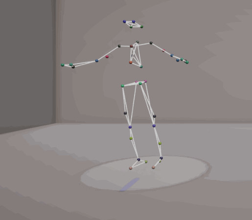
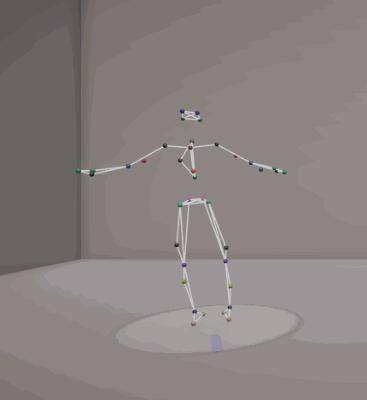
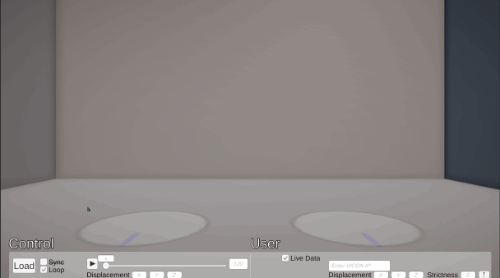
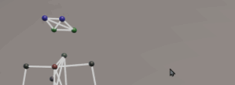
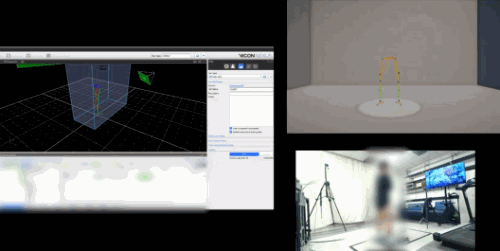
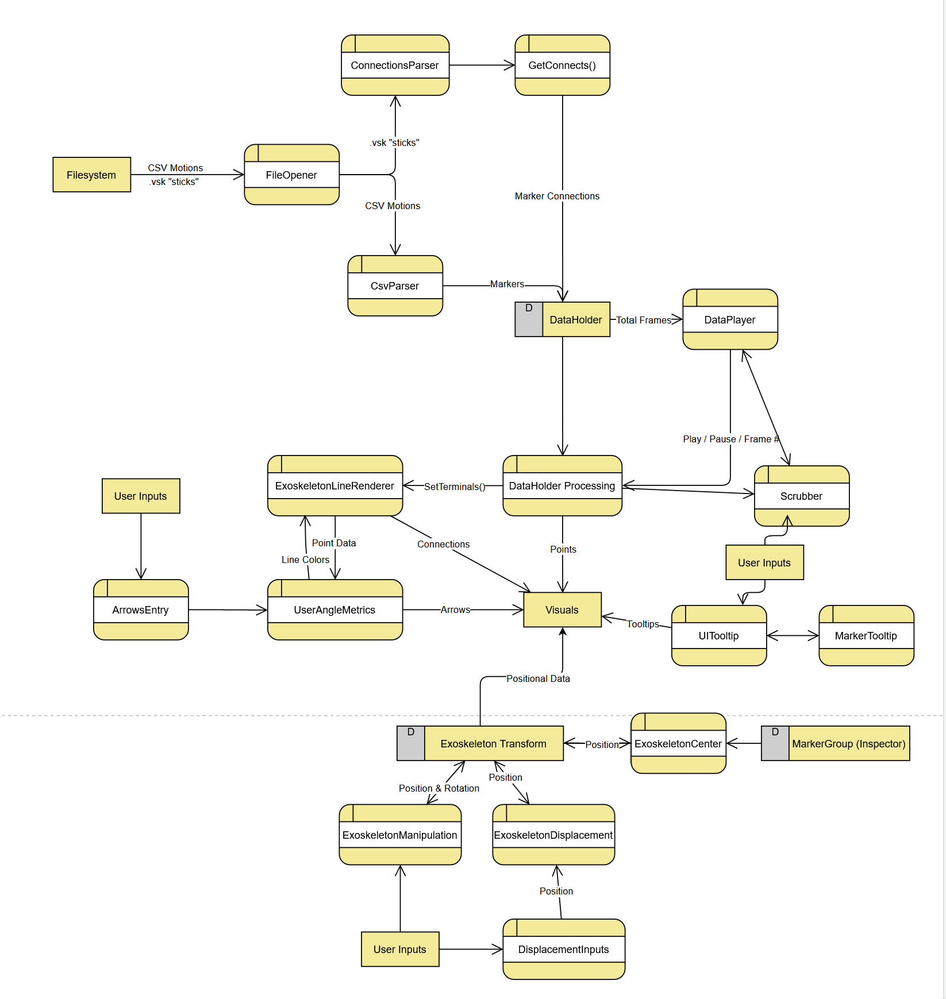

# Exoskeleton Analysis Tool (EAT)  

  

## How to Use

- Download the [latest release.](https://github.com/pizzatree/EVL-RRL-Exoskeleton/releases)  
- Open the executable (EAT.exe)
- On the Control side, open desired motion (order is not required)
- You will be prompted to also load the .vsk for the  marker connections
  - Once that's loaded, you don't have to worry for the remainder of the time the application's open  
- Enter local Vicon motion system IP for live tracking on the user side
- Compare motions with visual feedback, for additional feedback press the "Arrows" button on the user side
  - Specify which connections you want additional feedback for
  - When the connections are too far astray, an arrow will attempt to guide the user to the proper angle for those connections  
- Sensitivity can be adjusted on the user side if the tool is reading too far or too little into motions
- Other parameters are also exposed in the Unity inspector if necessary
  - Runtime values **will** take precedence if the application is being run within the Unity editor

## Software and Plugin Requirements  

- [Unity 2021.2 family](https://unity3d.com/get-unity/download/archive)  
- [Unity Standalone File Browser 1.2](https://github.com/gkngkc/UnityStandaloneFileBrowser)  
- [Vicon Unity Plugin 1.3.1](https://www.vicon.com/software/third-party/unity/)
- [SAFullBodyIK](https://www.github.com/Stereoarts/SAFullBodyIK)

## How to Build  

- Pull the latest changes.
- Open with your [preferred mechanism.](https://docs.unity3d.com/2021.2/Documentation/Manual/GettingStartedOpeningProjects.html)

...  

### Windows, Mac, Linux executables  

- Follow the [recommended build guides](https://docs.unity3d.com/2021.2/Documentation/Manual/PlatformSpecific.html).  
- You may need to change settings in `Assets/UI/FileOpener.cs` and/or `Assets/UI/ArrowsEntry.cs` when building to non-Windows platforms.

### WebGL  

- Not supported right now.
- Everything *should* have compatibility with WebGL builds; however, the native file browser plugin requires additional considerations as noted in their respective files.
- As it stands right now, the application will build & deploy to WebGL but fails at IO locally.  

## Functionality  

### Operational

  
*Parsing and playback of motions*  
Scrubbing, looping, jumping to frames, and modifying the frame rate all are supported.  

  
*Scene Controls*  
Operator can left click-hold an exoskeleton to rotate, and hold both clicks to translate.

  
*Visual Feedback & Corrective Guidance*  
Connections between markers that do not abide by the control progressively highlight more red, with an option to specify connections that get corrective arrows.  
There is a "strictness" parameter exposed in the UI to make it more or less lenient, with an additional parameter exposed in the Unity Editor for the arrows individually.

  
*Native file browsers*  
Operator can open up CSV's in the initially provided format and .vsk's for ascertaining marker connections.  

  
*Tooltips*  
Highlighting a marker will bring up the marker's name.  

  
*Live Streaming*  
The surrounding context using the [Vicon DataStream SDK](#software-and-plugin-requirements).  

*Visualization mode selection*
Operator can choose the display mode between the exoskeleton and the humanoid 3d model.

### Next Steps  

- Sync motion with user's pace
- Welcoming environments
- More  

## Explanation of Main Scene Hierarchy  

[ Connections Parser ]  
Holds static reference to the parsed "sticks" after they come through
The sticks need only be opened once per application run.

\- Environment -  
Lighting and all visuals not related to exoskeletons.

\- Exoskeletons -

- Control Base
  - Collider + Manipulation & Displacement for user interaction, speeds are customizeable
  - 2 Sprite Renderers to show grab region and forward (for motion setup) axis
  - Exoskeleton Line Renderer, thickness is customizeable
  - Exoskeleton Center, Marker Group is customizeable
- User Base : Control Base
  - User Angle Metrics, good / bad colors, arrow, thresholds customizeable. Arrow Markers are the default markers to have Arrows if no user inputs.
All of the points and line renderers point and parent to these objects.

\- Humanoids -

A humanoid 3d model has been introduced that can move according to the data provided through an inverse kinematics algorithm. The plugin was used for the purpose is [SAFullBodyIK](https://www.github.com/Stereoarts/SAFullBodyIK) which allows different degrees of freedom regarding the management of the movement of the model. In this case, the head, shoulders, elbows, hands, hips, knees and feet were used as constraints for the movement of the model. Through the unity editor you can change the degree of freedom of movement and rotation of each part of the body.

- Control Base
  - Collider + Manipulation & Displacement for user interaction, speeds are customizeable
  - 2 Sprite Renderers to show grab region and forward (for motion setup) axis
  - Humanoid Center, Marker Group is customizeable
  - Humanoid 3d model with animation and SAFullBodyIK and Humanoid Movements scripts to control the movement of the model
- User Base : Control Base
  - Humanoid Metrics, good / bad colors, arrow, thresholds customizeable. 

Screens Canvas  

- Uses HidingPanel to fade when mouse is not over any UI elements
- Control Side
  - Data Holder, the monolithic knower of most things. Each side is hooked up to the relevant exoskeleton via the Inspector. Holds a point material so Unity doesn't strip it during builds.
    - Point size & body scale are customizeable via Inspector
  - Data Player, interfaces with the scrubber. Frame rate is changeable in inspector and runtime.
  - File Name is filled in via Open F(ile)E(xplorer)
  - Open FE starts the File Explorer with a csv filter. Environment slash is customizeable for non-Windows platforms.
  - Play Controls is a collection of UI elements that all interface with the object's Data Player
  - Displacement Options interfaces with the relevant exoskeleton base or humanoid base
  - Visualization Options allow to choose between the visualization of exoskeleton or humanoid 3d model
- User Side : Control Side
  - Strictness allows the user to change the leniency of the angles before the joints start changing colors.
  - Arrows Entry contains a button that opens an input field. If valid head tail pairs are put in, Arrows are instantiated to further guide the user through the UserAngleMetrics.

Mouse Canvas  
Just stores a panel, text object, and UI Tooltip script. Follows mouse and does raycasts to find objects with tooltips.  

## Data Flow  

  
